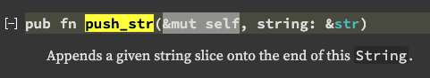
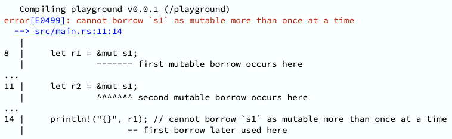
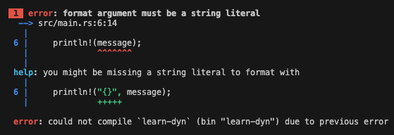
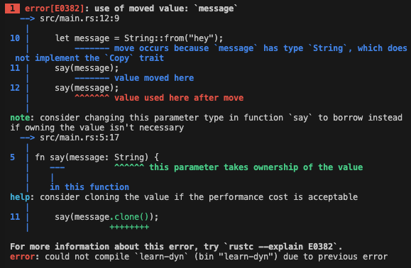

>  Incorporate the expressive syntax and flexibility of a high-level language with the fine control and performance of a low-level language

[](https://www.rust-lang.org/)


<br>
<br>

ClubMed - Zacaria Chtatar - Juin 2023

https://github.com/Zacaria/havesome-rust

---

### Rust

- bas niveau et haut niveau
- compilateur développé en OCaml puis en Rust
- Développé par [Rust Teams & Working Groups](https://www.rust-lang.org/governance/)
- Soutenu par [Rust Foundation](https://foundation.rust-lang.org/)
- langage le plus ❤️ depuis 7 ans

note:

 

---

## Quelques projets

----

### Github: [Index de recherche de code](https://github.blog/2023-02-06-the-technology-behind-githubs-new-code-search/)


45 millions de repos à indexer : <!-- .element: class="fragment" data-fragment-index="1" -->

- plusieurs mois avec Elasticsearch <!-- .element: class="fragment" data-fragment-index="2" -->
- 18h en Rust <!-- .element: class="fragment" data-fragment-index="3" -->

----

### Clouflare: [HTTP proxy](https://blog.cloudflare.com/how-we-built-pingora-the-proxy-that-connects-cloudflare-to-the-internet/)


- nginx plus assez rapide <!-- .element: class="fragment" data-fragment-index="1" -->
- customisation en C difficile <!-- .element: class="fragment" data-fragment-index="2" -->
- archi qui permet de partager les connexions entre les threads <!-- .element: class="fragment" data-fragment-index="3" -->

= 160x moins de connexions aux origins <!-- .element: class="fragment" data-fragment-index="4" -->
= 434 ans de handshake en moins chaque jour <!-- .element: class="fragment" data-fragment-index="5" -->

----

### Discord: [Service de messages lus](https://discord.com/blog/why-discord-is-switching-from-go-to-rust)


- Cache de plusieurs milliards d'entrées <!-- .element: class="fragment" data-fragment-index="1" -->
- Accès à chaque connexion, envoi de message, lecture... <!-- .element: class="fragment" data-fragment-index="2" -->
- latences toutes les 2 minutes en Go à cause du GC <!-- .element: class="fragment" data-fragment-index="3" -->

 <!-- .element: class="fragment" data-fragment-index="4" -->

note:

Pas de GC
Une variable est supprimée dès qu'elle n'a plus d'owner

----

Linux: [Le Kernel](https://linux.developpez.com/actu/337316/Rust-for-Linux-est-officiellement-fusionne-le-support-initial-de-Rust-for-Linux-fournit-l-infrastructure-de-base-et-une-integration-elementaire/)

- 2/3 des vulnérabilités viennent de la gestion mémoire
- attirer de jeunes devs

 <!-- .element: class="fragment" data-fragment-index="4" -->

note:
Kernel en Assembleur et C

---
## Pourquoi

Scalabilité

- espace
- temps
- fonctionnalité
- concurrence
- sécurité

note:

Les enjeux des logiciels qu'on dev sont de plus en plus complexes.

espace: empreinte mémoire
temps: vitesse d'execution, démarrage
fonctionnalité: quantité de fonctionnalité, il faut pouvoir refacto
sécurité: quantité de bugs possible augmente, et chaque faille ou bug peut coûter des millions

---

### À noter 

- temps de compilation

- pas idéal pour un mvp

- plus de devs que de missions

note:

on va survoler quelques features notables du langages

le temps de compilation vient du compilateur qui garantis la sécurité de la memory safety

peu de missions
- Juste une question de temps, de plus en plus de projets démarrent en Rust

ce serait facile d'attirer des devs

surtout des dev C experimentés
- Plus facile pour eux que pour des devs JS

----

> In other languages simple things are easy and complex things are possible, in Rust simple things are possible and complex things are EASY.


---

## Let's go !

https://doc.rust-lang.org/book/

https://doc.rust-lang.org/stable/rust-by-example/

note:

Je vais essayer de résumer quelques features afin d'arriver à ce qui donne vraiment de l'intérêt à Rust

---
### Types

```rust
let x: i32 = 42; // `i32` is a signed 32-bit integer

// i8, i16, i32, i64, i128
// u8, u16, u32, u64, u128 for unsigned

let array = [1, 2, 3, 4, 5];
let brray: [i32; 5] = [1, 2, 3, 4, 5];
let crray = [3; 5]; // [3, 3, 3, 3, 3]
```

note:

assignement est immutable par défaut

----

### Fonctions

```rust
fn main() {
    let x = plus_one(5);

    println!("The value of x is: {x}");
}

fn plus_one(x: i32) -> i32 {
    x + 1
}
```

note:
type dans les arguments et retour
executables: on part d'un main comme en C
on omet le ; pour retourner une valeur

---

### Ownership

- Un seul propriétaire de la donnée

- Plusieurs lecteur ou un seul éditeur

=> Mémoire libérée dès que le propriétaire est hors scope

note:
pas de pause
pas de GC
pas de référence vers rien, pas de undefined

----

#### move

```rust
let s1 = String::from("hello");
let s2 = s1; // s1 is moved into s2.
println!("{}", s1); // Error! s1's value has been moved to s2.
println!("{}", s2); // OK and moved into println!
println!("{}", s2); // Error! s2 moved

let s3 = s2.clone(); // s3 is unrelated to s2
println!("{}", &s3); // OK and still in scope
println!("{}", &s3); // OK and still in scope

```

note:
A noter que là on move aussi les variables dans les println!

----
#### immutable borrow

```rust
let s1: String = String::from("hello");
let s2: &String = &s1; // s3 has an immutable reference to s2 : immutable borrow

let len = calculate_length(&s1); // Immutable borrow happens successfully
s1.push_str(", world"); // Error! s1 has been borrowed as immutable.

fn calculate_length(s: &String) -> usize {
    s.len()
}
```

 <!-- .element: class="fragment" data-fragment-index="5" -->

<blockquote class="fragment" data-fragment-index="6"> On touche avec les yeux 👀 </blockquote>

note:

Si on ne veut pas que calculate_length prenne la possession de si

Il faut lui donner une référence

Deux références en même temps à s1 : s2 et celle donnée à calculate_length

[push_str](https://doc.rust-lang.org/std/string/struct.String.html#method.push_str) requiert un mutable borrow

----
#### mutable borrow

```rust
    let mut s1 = String::from("hello");
    let r1 = &mut s1;
    r1.push_str(", world"); // Mutable borrow happens successfully

    let r2 = &mut s1;
    r2.push_str(", world"); // Mutable borrow happens successfully
    
    println!("{}", r1); // r1 is still on scope 
    println!("{}", r2);
```


----
#### mutable borrow

<span class="fragment" data-fragment-index="1">

```rust
let mut s1 = String::from("hello");
change(&mut s1);
change(&mut s1);

fn change(s: &mut String) {
    s.push_str(", world");
}

println!("{}", s1); // hello, world, world
```
</span>

<p class="fragment" data-fragment-index="6"> chacun son tour 👮‍♂️ </p>

note:

La référence sort du scope a chaque de fin de change
Donc on peut tranquillement les appeler à la suite

----

#### Garanties:

- les référencent pointent vers quelque chose
- accès concurrents sécurisés

---

### if et for

```rust
fn main() {
    let number = 3;

    if number != 0 { // has to be boolean !
        println!("number was something other than zero");
    }

    for number in (1..4).rev() {
        println!("{number}!");
    }
    println!("LIFTOFF!!!");
}
```

.. : range

for peut prendre n'importe quel enumerable

----

### Strings

```rust [7|11|15|16|]
fn print_length(s: &str) { // &str better for function params
    println!("The length of '{}' is {}.", s, s.len());
}

fn main() {
    // A string literal is a &'static str
    let hello = "Hello, world!"; // hello: &str
    print_length(hello);

    // String::from creates a String from a string literal
    let hello_string = String::from(hello); // hello_string: String
    print_length(&hello_string);

    // You can mutate Strings
    let mut hello_mutable = hello_string.clone(); // hello_mutable: String
    hello_mutable.push_str(" And hello again.");
    print_length(&hello_mutable);
}
```

note:
le type à l'assignation peut être inféré

&str est immutable, vit dans la stack

String est mutable via des méthode, vit dans la heap

changer une string: on doit déclarer la variable mutable avec `mut`

&str est immutable, mieux pour les param de fonction : on peut prendre un slice d'une string sans en prendre l'ownership. Permet de passer String et literals.

String permet les mutations et l'ownership, parfait pour retourner des strings.

mut: toutes les assignations immutables par défaut. Même en profondeur dans les objets.

toutes les strings sont utf8 par défaut

---

### Le compilateur ❤️

<span class="fragment" data-fragment-index="1">

```rust
fn say(message: &str) {
    println!(message);
}

fn main() {
    let message = "hey";
    say(message);
}
```
</span>

 <!-- .element: class="fragment" data-fragment-index="2" -->

----
### Le compilateur ❤️

<span class="fragment" data-fragment-index="1">

```rust

fn say(message: String) {
    println!("{}", message);
}

fn main() {
    let message = String::from("hey");
    say(message);
    say(message);
}
```

</span>

 <!-- .element: class="fragment" data-fragment-index="2" -->

---

## Structures de données

----

### Tuples

```rust
fn main() {
    let tup = (500, 6.4, "one");

    let (x, y, z) = tup;
    let five_hundred = tup.0;
    let six_point_four = tup.1;
}
```

note: 
On groupe des données qu'on peut destructurer
On utilise le tuple vide pour représenter le type void

----

### Enums & Structs

```rust
enum Sign {
    PLUS,
    MINUS
}
struct Number {
    sign: Sign, // les structs peuvent contenir des enums
    value: u32,
}

// On peut les initialiser en literal
let x = Number { sign: Sign::PLUS, value: 2 };
let y = Number { value: 3, sign: Sign::MINUS };
let z = Number { value: 5, ..y };
// l'ordre des propriétés n'est pas important
```

note:

```rust
impl Number {
    fn new(value: u32, positive: bool) -> Self {
        let sign = if positive {
            Sign::PLUS
        } else {
            Sign::MINUS
        };
        Number { sign, value }
    }
}

fn main() {
    let num = Number::new(10, true);
}

```

----

```rust [1-4|5-14|]
enum Sign {
    PLUS,
    MINUS
}
struct Number {
    sign: Sign,
    value: u32,
}
impl Number {
    fn is_even(self) -> bool {
        self.value % 2 == 0
    }
}

fn main () {
    let minus_two = Number {
        sign: Sign::MINUS,
        value: 2,
    };
    println!("{}", minus_two.is_even());
}
```

note:

On peut déclarer des méthodes

----


```rust
struct FakeCat {
    alive: bool,
    hungry: bool,
}

let zombie = FakeCat { alive: false, hungry: true }; // ???

```

>On peut facilement représenter
>des systèmes sans état invalide

```rust
enum RealCat {
    Alive { hungry: bool }, // les enums peuvent contenir de struct
    Dead,
}
```

note: 

Dans les autres langages il faudrait implémenter des getters, setters et autres logiques pour protéger le système d'états incorrects


---

### Comment représenter l'absence de données ?

<span>`undefined` ? </span> <!-- .element: class="fragment" data-fragment-index="1" -->

<span>`null` ? </span><!-- .element: class="fragment" data-fragment-index="2" -->

Traiter ces cas reste optionnel<!-- .element: class="fragment" data-fragment-index="3" -->

note:

tester null en js

```js
typeof null          // "object" (not "null")
typeof undefined     // "undefined"
null === undefined   // false
null  == undefined   // true
null === null        // true
null  == null        // true
!null                // true
isNaN(1 + null)      // false
isNaN(1 + undefined) // true
```

----

### Option

=> [doc](https://doc.rust-lang.org/std/option/enum.Option.html)

```rust [1-6|9|11-14|17-19]
fn yes_or_no(value: i32) -> Option<i32> {
    if value == 0 {
        return None;
    }
    Some(value)
}

fn main() {
    let possibly_a_number = yes_or_no(12);

    let message = match possibly_a_number {
        Some(x) => format!("you've got a {}", x),
        None => String::from("you've got nothing"),
    };
    println!("{}", message); // you've got a 12

    let nothing: Option<i32> = yes_or_no(0);
    let message2 = nothing.unwrap(); // thread 'main' panicked at 'called `Option::unwrap()` on a `None` value'
    let message3 = nothing.expect("an error occured"); // thread 'main' panicked at 'an error occured'
}
```

note:

- Le compilateur s'assure qu'on couvre tous les cas !
- explicite
- force la gestion d'erreurs

unwrap et expect ne doivent pas aller en production !

unwrap_or ajoute une condition logique

---


### Les erreurs

<span class="fragment" data-fragment-index="1">

```js
function fetchFile (file) {
    try {
        const file = fs.readFileSync('./data.json')
    } catch (err) {
        console.error("something happened")
    }
}

```
</span>

- rien ne dit que readFileSync peut renvoyer une erreur <!-- .element: class="fragment" data-fragment-index="2" -->
- ni le type d'erreur renvoyé <!-- .element: class="fragment" data-fragment-index="3" -->
- on découvre les erreurs à l'execution <!-- .element: class="fragment" data-fragment-index="4" -->

note:

Rien ne dit que la fonction peut renvoyer une erreur.
Et que l'appelenat doit la gérer
On aurait carrément pu ne pas mettre de try catch

Au moment de dev, on a peu de connaissance sur les erreurs possibles

----
### Result

=> [doc](https://doc.rust-lang.org/std/result/enum.Result.html)

```rust [4|5|6|7|11|12|17|20|]
use std::fs::File;
use std::io::Read;

fn read_file_contents(path: &str) -> Result<String, std::io::Error> {
    let mut file = match File::open(path) {
        Ok(file) => file,
        Err(e) => return Err(e),
    };

    let mut contents = String::new();
    file.read_to_string(&mut contents)?; // Propagate any errors from read_to_string
    Ok(contents)
}

fn main() -> Result<(), Box<dyn std::error::Error>> {
    let path = "example.txt";
    let contents = read_file_contents(path)?; // Propagate any errors from read_file_contents

    println!("File contents:\n{}", contents);
    Ok(())
}

```
---

### Traits: interfaces en plus flexibles

- définies n'importe où
- méthodes par défaut
- composition de traits
- peuvent être passé en paramètre

----

```rust
trait Printable {
    fn print(&self);
}

// Implement Printable for the Person struct
struct Person {
    name: String,
}

impl Printable for Person {
    fn print(&self) {
        println!("Name: {}", self.name);
    }
}

// Implement Printable for the Car struct
struct Car {
    model: String,
}

impl Printable for Car {
    fn print(&self) {
        println!("Model: {}", self.model);
    }
}

fn main() {
    let person = Person { name: String::from("John") };
    let car = Car { model: String::from("Tesla") };

    person.print(); // Output: Name: John
    car.print(); // Output: Model: Tesla
}

```

note:


---

### Tests unitaires

```rust
pub fn sum_as_string(a: i32, b: i32) -> String {
    (a + b).to_string()
}


#[cfg(test)]
mod tests {
    use crate::*;
    #[test]
    fn test_sum_as_string() {
        assert_eq!(sum_as_string(1,2), "3");
    }
}
```

note:

TUs dans le même fichier que le code

----

### Tests d'integration

```csharp
.
├── Cargo.lock
├── Cargo.toml
├── src
│   └── lib.rs
└── tests
    └── integration_test.rs

```

```rust
// integration_test.rs
use my_crate::my_function;

#[test]
fn test_my_function_integration() {
    // Test the function under some scenario
    assert_eq!(my_function("test input"), "expected output");
}
```

---

### Macros

- Génère du code source qui sera compilé
- Permet de créer n'importe quelle syntaxe

`println!` : fonction variadique
`#[cfg(test)]` : compile les tests seulement en conf de test

note:
println! est une macro pour:
- avoir un nombre variable d'arguments
- string interpolation
- checks à la compilation que le nombre d'arg == le nb de {}

----


```rust
#[derive(Debug)]
struct Cat {
    hungry: bool,
}

// The Rust compiler generates code that looks like this...
impl std::fmt::Debug for Cat {
    fn fmt(&self, f: &mut std::fmt::Formatter<'_>) -> std::fmt::Result {
        f.debug_struct("Cat")
            .field("hungry", &self.hungry)
            .finish()
    }
}

fn main() {
    let cat = Cat { hungry: true };
    println!("{:#?}", cat); // Cat { hungry: true }
    println!("{}", cat); // `Cat` cannot be formatted with the default formatter
}
```

---

### Cargo

```sh
cargo new my_project

# compile and execute
cd my_project
cargo run

# compile
cargo build

# compiler for production
cargo build --release
```

```toml
# Cargo.toml
[package]
name = "my_project"
version = "0.1.0"
authors = ["Name <your.email@example.com>"]
edition = "2021"

[dependencies]
serde = version="1.0.132"
uuid = { version = "0.8", features = ["v4"] }
```

note:
Les crates en dépendances ne tirent pas par défaut toutes les fonctionnalités
Il faut regarder dans leur doc ou Cargo.toml, les fonctionnalités à importer en plus
----

### Cargo

- `cargo test`
- `cargo fmt`
- `cargo check`
- `cargo package` `cargo publish`
- `cargo bench`

----

#### Cargo

```rust
/// Formats the sum of two numbers as a string.
///
/// # Examples
///
/// ```
/// let result = mycrate::sum_as_string(5, 10);
/// assert_eq!(result, "15");
/// ```
pub fn sum_as_string(a: i32, b: i32) -> String { (a + b).to_string() }
```

`cargo doc --open`

note:

exemple d'un doc test.
coverage
executé pendant les tests
garde les exemples à jour
seulement pour les modules ou les libs

----

#### Cargo

```rust
#![feature(test)]
extern crate test;
use test::Bencher;

#[bench]
fn bench_add(b: &mut Bencher) {
    b.iter(|| 2 + 2)
}
```

---

### On n'a pas abordé

Plein de choses dont :

- Smart-pointers
- Multi-thread
- Mode unsafe
- Lifetimes 

note:

les traits sont plus flexibles
- méthodes par défaut
- composition de traits
- peuvent être passé en paramètre

lifetime précise la durée de vie des références

smart pointers: types that wrap around a value and provide additional capabilities.
more flexible memory management, shared ownership, and safe mutation of data.

- Box<T>: heap allocation & automatic deallocation.
- Rc<T>: reference-counted smart pointer that allows multiple ownership of the same data.
- Arc<T>: atomic reference-counted smart pointer, similar to Rc<T>, but with thread-safe atomic operations.
- RefCell<T>: smart pointer that enables interior mutability, allowing mutable access even with immutable references.

---

## Getting Started

cargo: [rustup.rs](https://rustup.rs/)

Language Syntax Protocol: [rust analyzer](https://rust-analyzer.github.io/)

background rust code checker: [](https://docs.rs/crate/bacon/latest)

---

## Tips

`todo!()` <!-- .element: class="fragment" data-fragment-index="1" -->

modéliser avant de coder <!-- .element: class="fragment" data-fragment-index="2" -->

ChatGPT 😎 <!-- .element: class="fragment" data-fragment-index="3" -->

note:

println! est une macro pour:
- avoir un nombre variable d'arguments
- string interpolation
- checks à la compilation que le nombre d'arg == le nb de {}

---

# Next

HTTP: [reqwest](https://github.com/seanmonstar/reqwest)

Backend: [axum](https://github.com/tokio-rs/axum), [actix](https://github.com/actix/actix-web)

Front: [yew](https://github.com/yewstack/yew)

Fullstack: [Leptos](https://github.com/leptos-rs/leptos)

Client lourd: [tauri](https://github.com/tauri-apps/tauri)

Jeux: [bevy](https://bevyengine.org/)

CLI: [clap](https://github.com/clap-rs/clap)

----

## Super crates

Json parse: [serde](https://github.com/serde-rs/serde)

String parse: [nom](https://github.com/rust-bakery/nom)

Asynchrone: [tokio](https://github.com/tokio-rs/tokio)

---

# Liens

- Rust book
- [Rustlings](https://github.com/rust-lang/rustlings)
- Playground : https://play.rust-lang.org/?version=stable&mode=debug&edition=2021
- fasterthanlime
- Noboilerplate

---

### Merci


---

## Le problème

> Je veux importer du code, du style ou une image dans ma page actuelle <!-- .element: class="fragment" data-fragment-index="1" -->

Cheminement : <!-- .element: class="fragment" data-fragment-index="2" -->
- rien 🤷‍♂️: des scripts qui se partagent le scope global <!-- .element: class="fragment" data-fragment-index="3" -->
- (requirejs, browserify) + (grunt/gulp) : mot clé require <!-- .element: class="fragment" data-fragment-index="4" -->
- webpack : mot clé import <!-- .element: class="fragment" data-fragment-index="5" -->

---

